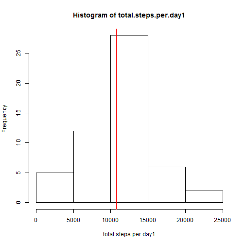
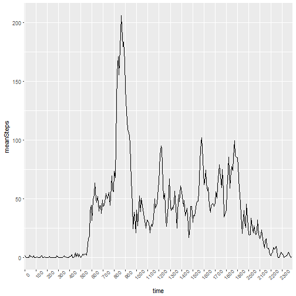
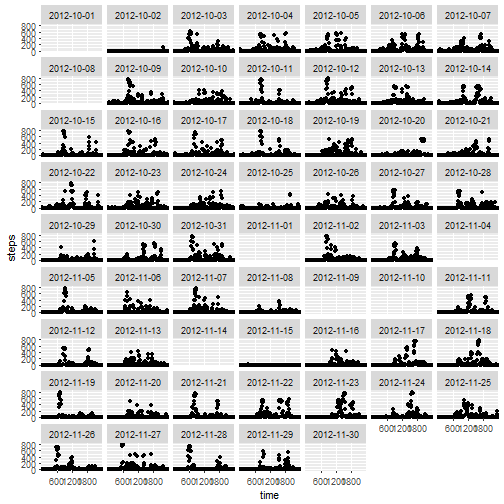
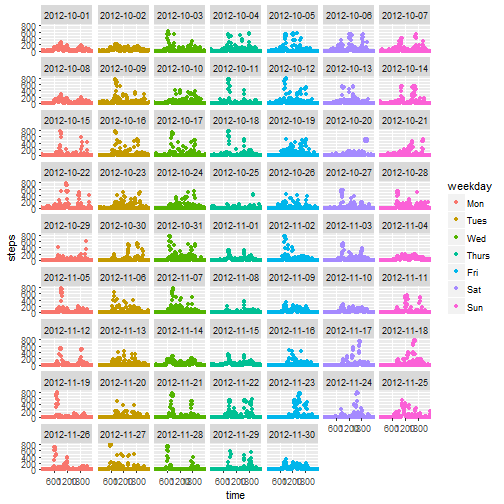
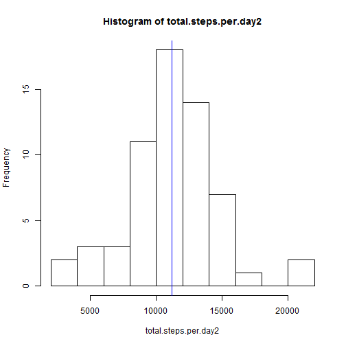
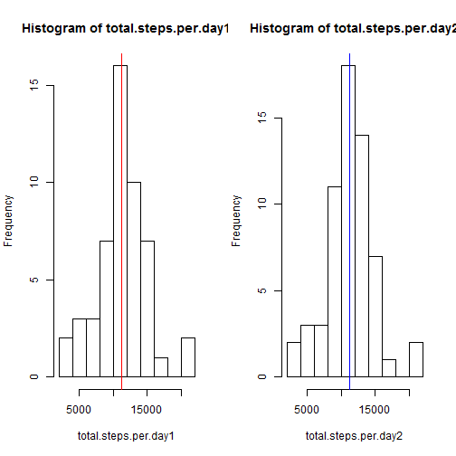
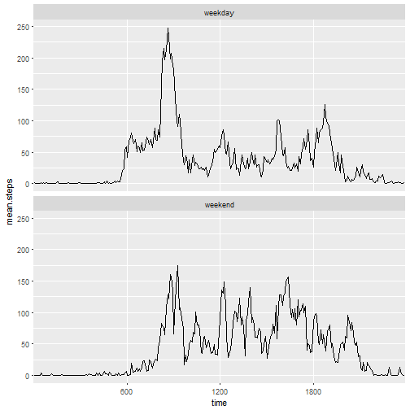

# Load librarys

```r
library(dplyr)
library(lubridate)
library(ggplot2)
```
# Loading and preprocessing the data
* Download, unzip and read

```r
if (!dir.exists("data")) {dir.create("data")}
fileURL <- "https://d396qusza40orc.cloudfront.net/repdata%2Fdata%2Factivity.zip"
download.file(fileURL, "data/activity.zip")
unzip("data/activity.zip", exdir = "data")
df <- read.csv("data/activity.csv")
```
* Glimpse at df

```r
glimpse(df)
```

```
## Observations: 17,568
## Variables: 3
## $ steps    <int> NA, NA, NA, NA, NA, NA, NA, NA, NA, NA, NA, NA, NA, N...
## $ date     <fctr> 2012-10-01, 2012-10-01, 2012-10-01, 2012-10-01, 2012...
## $ interval <int> 0, 5, 10, 15, 20, 25, 30, 35, 40, 45, 50, 55, 100, 10...
```
* Transform "date" variable to class "Date"
* Create variable "weekday"
* Reorder "weekday" factor levels (this will come in handy later when plotting)
* Transfrom interval to factor

```r
df$date <- as.Date(df$date, "%Y-%m-%d")
df$weekday <- wday(df$date, label = TRUE, abbr = TRUE)
df$weekday <- factor(df$weekday, levels = c("Mon", "Tues", "Wed", 
                                              "Thurs", "Fri", "Sat", "Sun"))
df$interval <- as.factor(df$interval)
glimpse(df) # Let's see how it looks now...
```

```
## Observations: 17,568
## Variables: 4
## $ steps    <int> NA, NA, NA, NA, NA, NA, NA, NA, NA, NA, NA, NA, NA, N...
## $ date     <date> 2012-10-01, 2012-10-01, 2012-10-01, 2012-10-01, 2012...
## $ interval <fctr> 0, 5, 10, 15, 20, 25, 30, 35, 40, 45, 50, 55, 100, 1...
## $ weekday  <ord> Mon, Mon, Mon, Mon, Mon, Mon, Mon, Mon, Mon, Mon, Mon...
```

***

# What is the mean total number of steps per day?

```r
total.steps.per.day1 <- as.numeric(tapply(df$steps, df$date, sum))
tspd.mean1 <- mean(total.steps.per.day1, na.rm = TRUE)
tspd.median1 <- median(total.steps.per.day1, na.rm = TRUE)
hist(total.steps.per.day1)
abline(v = tspd.mean1, col = "red")
```




*The mean of total steps per day is 10766 and the median of total steps per day is 10765*

***

# What is the average daily activity pattern?

```r
avgSteps.Intv <- df %>%
        group_by(interval) %>%
        summarize(meanSteps = mean(steps, na.rm = TRUE))
timeSeq <- seq(from = 1, to = 277, by = 12) # Used for x-axis tick breaks
p0 <- ggplot(avgSteps.Intv, aes(as.factor(interval), meanSteps, group = 1)) + 
        geom_line() + 
        scale_x_discrete(name = "time", 
                         breaks = avgSteps.Intv$interval[timeSeq]) +
        theme(axis.text.x = element_text(angle=45))
print(p0)
```



```r
maxSteps.Intv <- subset(avgSteps.Intv, meanSteps == max(meanSteps), interval)
```
*The five minute interval, on average across all days in the dataset, containing the maximum number of steps is 835* 

***

# Imputing missing values
1. Calculate and report the total number of missing values

```r
sum(is.na(df))
```

```
## [1] 2304
```
2. Strategy for filling in missing values
  + First, let's attempt to <b><i>see</i></b> the missing values.

```r
df0 <- df %>%
        group_by(weekday, interval) 
p1 <- ggplot(df0, aes(interval, steps)) + 
        geom_point() + 
        scale_x_discrete(name = "time", 
                         breaks = c("600","1200","1800")) + 
        facet_wrap(~ date , ncol = 7) 
```

```r
print(p1)
```

```
## Warning: Removed 2304 rows containing missing values (geom_point).
```


*Above, we see which dates have NA's, but more interestingly, we see dates with approximately zero steps (e.g., "2012-10-02", "2012-11-15"). Let's take a closer look at the total steps for those days.*

* Let's look at total steps on "2012-10-02" and "2012-11-15"

```r
df %>% 
        filter(date == "2012-10-02" | date == "2012-11-15") %>%
        group_by(date) %>%
        summarize(sum = sum(steps))
```

```
## # A tibble: 2 × 2
##         date   sum
##       <date> <int>
## 1 2012-10-02   126
## 2 2012-11-15    41
```

*Dates "2012-10-02" & "2012-11-15" have so few steps. Maybe the wearable device owner decided to charge the device battery or perhaps left their device at home when they went to work. Regardless, these dates would be better served with average values IMO.*

3. Create a new dataset that is equal to the original dataset but with the missing data filled in.
* First, for days "2012-10-02" and "2012-11-15" I will insert NA into the step variable. This way I can treat those days the same as other NA days when imputing a mean value for the respective interval step value.

```r
df$steps <- replace(df$steps, 
                    df$date == "2012-10-02" | df$date == "2012-11-15", NA)
```
* Compute average values across intervals using corresponding weekdays. 
We will then use those values to fill in our NA intervals.

```r
impute.mean <- function(x) replace(x, is.na(x), mean(x, na.rm = TRUE))
df1 <- df %>%
        group_by(weekday, interval) %>%
        mutate(steps = impute.mean(steps))
p2 <- ggplot(df1, aes(interval, steps, 
                      color = weekday)) + 
        geom_point() + 
        scale_x_discrete(name = "time", 
                         breaks = c("600","1200","1800")) + 
        facet_wrap(~ date , ncol = 7) 
```

```r
print(p2)
```



4. Make a histogram of the total number of steps taken each day.  What is the impact of imputing missing data on the estimates of the total daily number of steps?

```r
total.steps.per.day2 <- as.numeric(tapply(df1$steps, df$date, sum))
tspd.mean2 <- mean(total.steps.per.day2, na.rm = TRUE)
tspd.median2 <- median(total.steps.per.day2, na.rm = TRUE)
hist(total.steps.per.day2)
abline(v = tspd.mean2, col = "blue")
```



  + Calculate and report the mean and median total number of steps taken per day.

*The mean of total steps per day is 11156 and the median of total steps per day is 11015*

  + Do these values differ from the estimates from the first part of the assignment?
    + Yes, see below
    


*The data with imputed values shows a greater mean steps per day which is expected becuase the original data had two days with 0 steps.* 

***

# Are there differences in activity patterns between weekdays and weekends?
1. Create a new factor variable in the dataset with two levels `weekend` and `weekday` indicating whether a given date is a weekday or weekend day.

```r
df1$daygroup <- as.factor(ifelse(wday(df$date) == 1 | wday(df$date) == 7, 
                             "weekend", "weekday"))
```
2. Make a panel plot containing a time series plot (i.e. type = "l") of the 5-minute interval (x-axis) and the average number of steps taken, averaged across all weekday days or weekend days (y-axis). See the README file in the GitHub repository to see an example of what this plot should look like using simulated data.

```r
df2 <- df1 %>%
        group_by(daygroup, interval) %>%
        summarize(mean.steps = mean(steps))
p3 <- ggplot(df2, aes(interval, mean.steps, group = 1)) +
        geom_line() + facet_wrap(~daygroup, nrow = 2) + 
        scale_x_discrete(name = "time", 
                         breaks = c("600","1200","1800"))
```

```r
print(p3)
```




